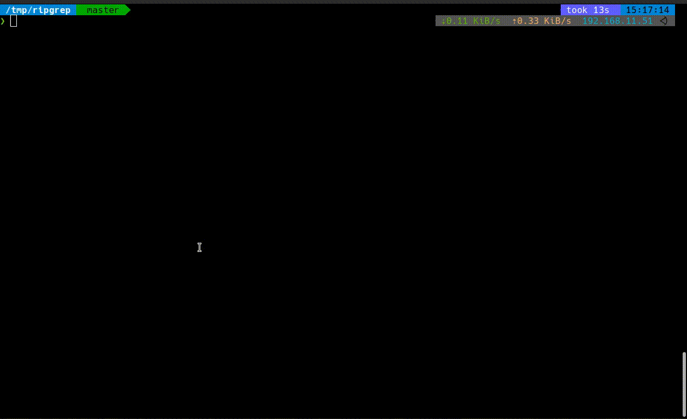

# lightline-lsp-progress

This plugin enables to show Language Server progress on vim status line.

https://github.com/itchyny/lightline.vim  
https://github.com/prabirshrestha/vim-lsp



## Install

Use your favorite plugin manager.
An example using vim-plug is shown as follows.

```vim
Plug 'prabirshrestha/vim-lsp'
Plug 'itchyny/lightline.vim'
Plug 'micchy326/lightline-lsp-progress'
```

## Setting example

set `g:lightline` in your vimrc.

```vim
let g:lightline = {
\ 'active': {
\   'left': [ [ 'mode', 'paste' ],
\             [ 'readonly', 'filename', 'modified', 'lsp_status' ] ]
\ },
\ 'component_function': {
\   'lsp_status': 'lightline_lsp_progress#progress',
\ },
\ }
```

## Configuration
- `g:lightline_lsp_progress_skip_time`  
Suppresses the frequency of status line updates.
Prevents heavy operation when using a language server that sends frequent progress notifications.  
default: 0.3 ms

